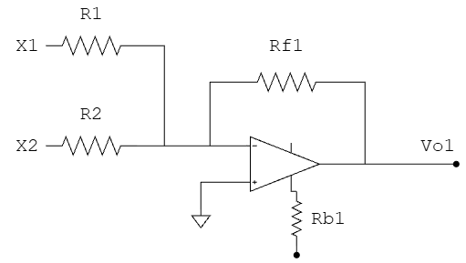
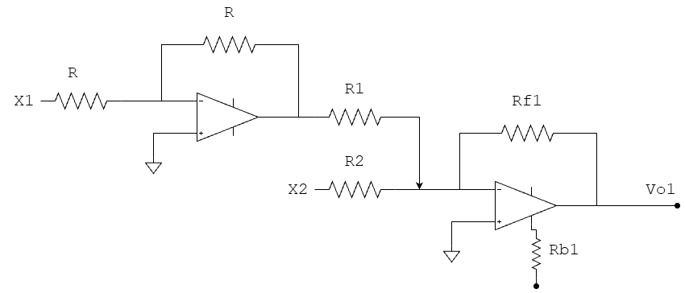
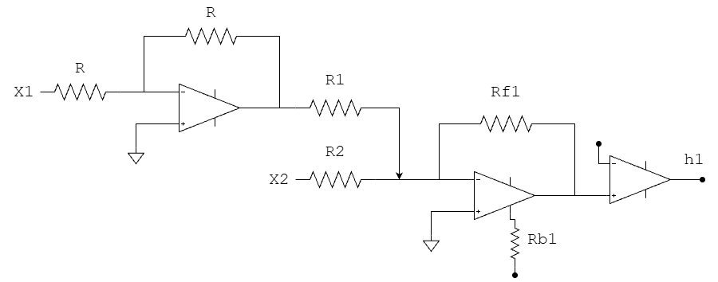
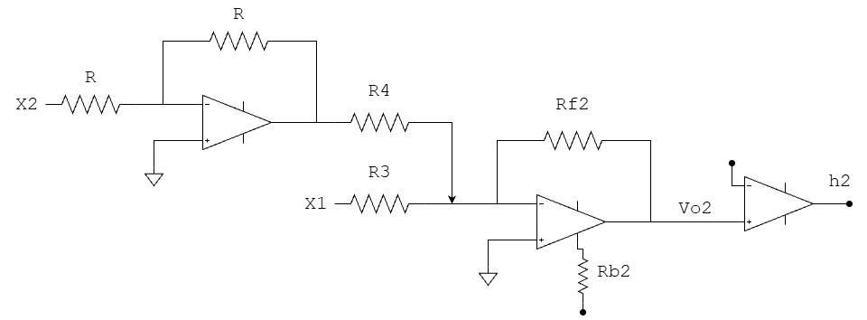
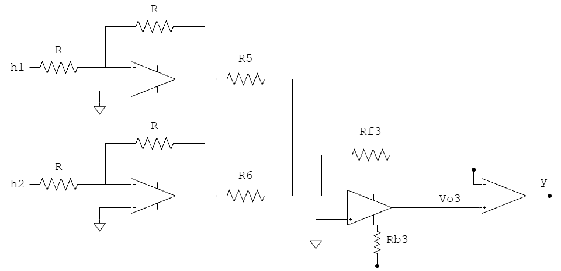
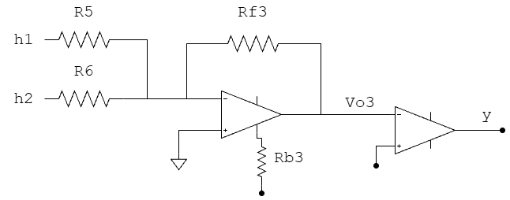
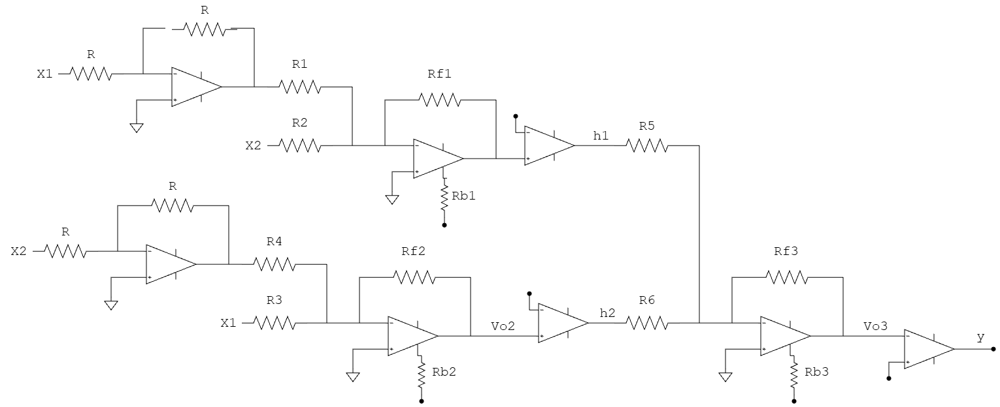

# Red neuronal de XOR aplicada en Hardware

## Diseño de la red neuronal

| $X_1$ | $X_2$ | $y$ |
|:---:|:---:|:---:|
| 0 | 0 | 0 |
| 0 | 1 | 1 |
| 1 | 0 | 1 |
| 1 | 1 | 0 |

El diseño de la red neuronal para este problema incluye una capa oculta al no ser un problema separable linealmente.

  

Se entrenó esta red neuronal en Google collab en el código `Tarea 3_Algoritmos_AP.ipynb` en el que se obtuvo los pesos listados.

**Pesos y sesgos obtenidos:**
* $w_1 = 11.96$
* $w_2 = -12.25$
* $w_3 = -12.32$
* $w_4 = 12.03$
* $w_5 = 16.99$
* $w_6 = 16.95$
* $b_1 = -6.27$
* $b_2 = -6.29$
* $b_3 = -8.49$

## Normalización de los pesos de la red

Como los pesos que se tienen están fuera del rango entre 0 y 1, es necesario normalizarlos con el fin de que los voltajes no se disparen en el hardware. Para ello, los pesos se dividen entre un factor $K$ que en este caso se elige de forma arbitraria como $K=20$.

| | | |
|:---|:---|:---|
| $W_1 = 0.598$ | $W_3 = -0.616$ | $W_5 = 0.8495$ |
| $W_2 = -0.6125$ | $W_4 = 0.6015$ | $W_6 = 0.8475$ |
| $b_1 = -0.3135$ | $b_2 = -0.3145$ | $b_3 = -0.4245$ |

## Implementación de la arquitectura de red en Hardware

**Sumador inversor de $h_1$**

  

$$
V_{o_1} = -R_{f_1} \left( \frac{X_1}{R_1} + \frac{X_2}{R_2} \right)
$$

$$
V_{o_1} = -\frac{R_{f_1}}{R_1} X_1 - \frac{R_{f_1}}{R_2} X_2
$$

De la red neuronal se tiene que ($V$ es el voltaje de trabajo):

$$
n_1 = W_1 X_1 + W_2 X_2 + b_1 V
$$

Sustituyendo los pesos:

$$
n_1 = 0.598 X_1 - 0.6125 X_2 - 0.3135 V
$$

Para que se puedan representar los pesos correctamente en el circuito es necesario un amplificador inversor a la entrada de $X_1$, quedando el circuito de la siguiente manera:

  

$$
V_{o_1} = \frac{R_{f_1}}{R_1} X_1 - \frac{R_{f_1}}{R_2} X_2
$$

Para completar esta neurona en circuito se añade un comparador.

  

**Sumador inversor de $h_2$**

De la misma manera, teniendo en cuenta la red:

$$
n_2 = W_3 X_1 + W_4 X_2 + b_2 V
$$

Sustituyendo:

$$
n_2 = -0.616 X_1 + 0.601 X_2 - 0.3145 V
$$

El circuito con amplificadores para esta neurona sería el siguiente:

  

$$
V_{o_2} = -\frac{R_{f_2}}{R_3} X_1 + \frac{R_{f_2}}{R_4} X_2
$$

---

**Sumador inversor final**

El sumador final tiene como entradas a $h_1$ y $h_2$.

$$
n_3 = W_5 h_1 + W_6 h_2 + b_3 V
$$

Sustituyendo:

$$
n_3 = 0.8495 h_1 + 0.8475 h_2 - 0.4245 V
$$

El circuito quedaría de la siguiente manera:

  

$$
V_{o_3} = \frac{R_{f_3}}{R_5} h_1 + \frac{R_{f_3}}{R_6} h_2
$$

Se puede simplificar este circuito cambiando el comparador.

  

Teniendo ahora el circuito completo:

  

El circuito se plantea con $5V$, al incluir los bias en las ecuaciones de las salidas de las neuronas el voltaje lógico es $0V$, para los comparadores de las neuronas de la capa oculta $V_o > 0 \rightarrow 1$ y para el comparador final $V_o < 0 \rightarrow 1$.

---

### Tabla 1. Lógica de la neurona $h_1$

$$
n_1 = 0.598 X_1 - 0.6125 X_2 - 0.3135 (5V)
$$

| $X_1$ | $X_2$ | $V_{o_1}$ | $h_1$ |
|:---:|:---:|:---:|:---:|
| 0 | 0 | -1.56 V | 0V |
| 0 | 5V | -4.63 V | 0V |
| 5V | 0 | +1.42 V | 5V |
| 5V | 5V | -1.64 V | 0V |

---

### Tabla 2. Lógica de la neurona $h_2$

$$
n_2 = -0.616 X_1 + 0.601 X_2 - 0.3145 (5V)
$$

| $X_1$ | $X_2$ | $V_{o_2}$ | $h_2$ |
|:---:|:---:|:---:|:---:|
| 0V | 0V | -1.57 V | 0V |
| 0V | 5V | +1.43 V | 5V |
| 5V | 0V | -4.65 V | 0V |
| 5V | 5V | -1.64 V | 0V |

---

### Tabla 3. Lógica de la neurona final

$$
n_3 = 0.8495 h_1 + 0.8475 h_2 - 0.4245 (5V)
$$

| $h_1$ | $h_2$ | $V_{o_3}$ | $y$ |
|:---:|:---:|:---:|:---:|
| 0V | 0V | 2.12 V | 0 |
| 0V | 5V | -2.11 V | 5V |
| 5V | 0V | -2.12 V | 5V |
| 0V | 0V | 2.12 V | 0V |

---

### Tabla 4. Valores de resistencias a la capa oculta

| Componente | Peso Normalizado | Cálculo teórico | Valor comercial |
|:---:|:---:|:---:|:---:|
| $R_f$ | N/A | $10\ k\Omega$ | $10\ k\Omega$ |
| $R_1$ | $\approx 0.6$ | $16.7\ k\Omega$ | $16\ k\Omega$ |
| $R_2$ | $\approx 0.61$ | $16.4\ k\Omega$ | $16\ k\Omega$ |
| $R_3$ | $\approx 0.61$ | $16.4\ k\Omega$ | $16\ k\Omega$ |
| $R_4$ | $\approx 0.6$ | $16.7\ k\Omega$ | $16\ k\Omega$ |
| $R_{b_1}$ | $\approx 0.31$ | $32.3\ k\Omega$ | $33\ k\Omega$ |
| $R_{b_2}$ | $\approx 0.31$ | $32.3\ k\Omega$ | $33\ k\Omega$ |
| $R_5$ | $\approx 0.85$ | $11.8\ k\Omega$ | $12\ k\Omega$ |
| $R_6$ | $\approx 0.85$ | $11.8\ k\Omega$ | $12\ k\Omega$ |
| $R_{b_3}$ | $\approx 0.42$ | $23.8\ k\Omega$ | $24\ k\Omega$ |