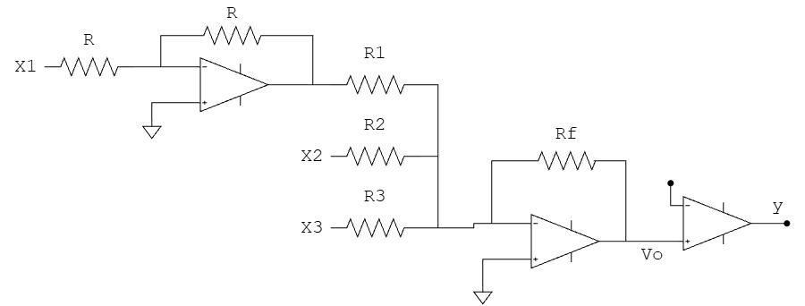

# Red neuronal en Hardware

| $X_1$ | $X_2$ | $X_3$ | $y$
|:---:|:---:|:---:| :---: |
| 1 | 0 | 0 | 1 |
| 1 | 0 | 1 | 1 |
| 1 | 1 | 0 | 1 |
| 1 | 1 | 1 | 0 |

Se tiene la red neuronal de una neurona para entrenar con estos datos.

  

**Pesos obtenidos:**
* $w_1 = 0.8$
* $w_2 = -0.2$
* $w_3 = -0.1$

Con esta información se plantea el circuito que se necesita para llevar a hardware la red neuronal.

  

$$n=w_1X_1+w_2X_2+w_3X_3$$

Sustituyendo los valores:

$$n=0.8X_1-0.2X_2-0.1X_3$$

Trasladando esto en el Hardware:

$$
V_o=\frac{R_f}{R_1}X_1-\frac{R_f}{R_2}X_2-\frac{R_f}{R_3}X_3
$$

Con esto se calcula la lógica con voltaje con 5V

| $X_1$ | $X_2$ | $X_3$ | $V_{o}$ | $y$ |
|:---:|:---:|:---:|:---:|:---:|
| 5V | 0 | 0 | 4V | 1 |
| 5V | 0 | 5V | 3.5V | 1 |
| 5V | 5V | 0 | 3V | 1 |
| 5V | 5V | 5V | 2.5V | 0 |

Se proponen resistencias $R_f$ de $2k\Omega$ con esto se calculan las resistencias $R_1$, $R_2$ y $R_3$.

| Componente | Peso | Cálculo teórico |
|:---:|:---:|:---:|
| $R_f$ | N/A | $2\ k\Omega$ |
| $R_1$ | $0.8$ | $2.5\ k\Omega$ |
| $R_2$ | $0.2$ | $10\ k\Omega$ |
| $R_3$ | $0.1$ | $20\ k\Omega$ |

Se llevó a cabo en circuito, se puede ver su funcionamiento en el video `Tarea 4. Video Red Neuronal.mp4`.

El esquema del circuito hecho a detalle se observa en las siguientes imagenes.

  

  

