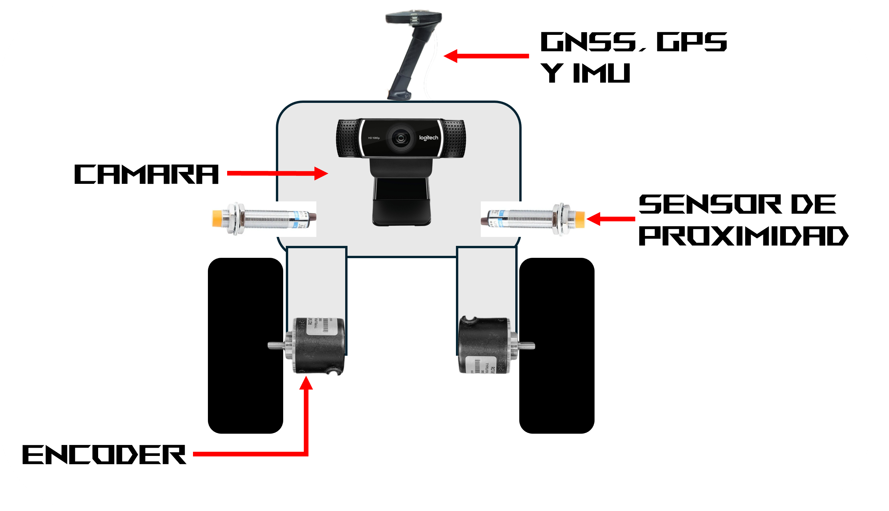

# Control Inteligente para navegación autónoma de robot agrícola

## Planteamiento del problema

La navegación autónoma de robots agrícolas a través de surcos se ha abordado principalmente con el uso de sensores de proximidad, encoder, IMU, cámara con algoritmos de visión artificial y sistemas de posicionamiento satelital. Cada una de estas tecnologías aplicadas tienen sus ventajas y limitaciones en los diversos escenarios que se dan en un campo de cultivo. En este trabajo se plantea la lógica de un controlador inteligente para navegación autónoma de un robot diferencial con dos motores que sea capaz de ir a través de hileras de plantas, dar vuelta al final de surco y entrar en el siguiente, con el objetivo de realizar labores culturales en las primeras etapas del cultivo. Se contempla el uso de sensores de proximidad a los lados del robot, un algoritmo de visión capaz de detectar las hileras y el final de surco, sensores encoder e IMU para conocer los rumbos y las distancias en la navegación, siendo los sensores principales para el cambio de surco, y un sistema de posicionamiento satelital para la definición de los límites de la parcela a trabajar.

  

## Tabla de verdad del controlador supervisor de navegación autónoma

Robot diferencial para labores culturales entre hileras de cultivo. Diez entradas binarias provenientes de la fusión de visión artificial, sensores de proximidad, odometría inercial, posicionamiento satelital y el planificador de cobertura; siete salidas que definen el comportamiento del robot. 576 estados físicamente posibles.

### Variables de entrada
| Var | Tecnología | Significado cuando vale 1 |
|:---:|:---|:---|
| **VI** | Cámara (visión artificial) | El robot está desviado hacia la izquierda del centro del surco |
| **VD** | Cámara (visión artificial) | El robot está desviado hacia la derecha del centro del surco |
| **PI** | Proximidad izquierdo, umbral corto | Hilera demasiado cerca del costado izquierdo |
| **PD** | Proximidad derecho, umbral corto | Hilera demasiado cerca del costado derecho |
| **AI** | Proximidad izquierdo, umbral largo | Ausencia de planta a la izquierda, sostenida por distancia |
| **AD** | Proximidad derecho, umbral largo | Ausencia de planta a la derecha, sostenida por distancia |
| **FV** | Visión artificial | El algoritmo ya no detecta hileras en la región de avance |
| **FD** | Encoder + IMU (odometría) | Distancia recorrida $\geq$ longitud esperada del surco menos el margen |
| **FG** | GNSS | La posición del robot cae dentro de la zona de cabecera |
| **DG** | Planificador de cobertura | El siguiente surco está a la izquierda (0 = a la derecha) |

### Variables de salida

| Var | Acción | Observación |
|:---:|:---|:---|
| **A1** | Avance recto | El control continuo calcula la velocidad |
| **A2** | Corrección a la derecha | El control continuo calcula la magnitud del giro |
| **A3** | Corrección a la izquierda | El control continuo calcula la magnitud del giro |
| **A4** | Maniobra completa de giro a la derecha | Orden al secuenciador, no comando de motor |
| **A5** | Maniobra completa de giro a la izquierda | Orden al secuenciador, no comando de motor |
| **A6** | Paro | Detención con aviso al operador |
| **A7** | Habilitación de velocidad reducida | Modificador independiente de A1 a A6 |

### Criterio de fusión para el fin de surco

La columna E de la tabla es la evidencia acumulada de fin de surco, E = FV + FD + FG. No es una entrada de la red

| E | Lectura | Acción del controlador |
|:---:|:---|:---|
| **0** | Ninguna fuente indica fin de surco | Navegación normal a velocidad plena |
| **1** | Evidencia parcial de una sola fuente | Continuar a velocidad reducida para verificar |
| **2** | Confirmado por dos fuentes | Maniobra de giro si el candado lateral está abierto (AI = AD = 1) |
| **3** | Confirmado por las tres fuentes | Maniobra de giro; el escalamiento libera el candado lateral |

### Tabla condensada: 15 reglas con prioridad

| Regla | VI VD PI PD AI AD FV FD FG DG | Acción | A7 | Estados | Interpretación |
|:---:|:---|:---:|:---:|:---:|:---|
| **R1** | X X 1 1 X X X X X X | PARO | 0 | 64 | Surco obstruido en ambos lados |
| **R2** | X X X X X X 1 1 1 0 | GIRO DER | 1 | 32 | Fin confirmado por las 3 fuentes (E=3) |
| **R3** | X X X X X X 1 1 1 1 | GIRO IZQ | 1 | 32 | Fin confirmado por las 3 fuentes (E=3) |
| **R4** | X X X X 1 1 1 1 0 0 | GIRO DER | 1 | 4 | E=2 visión+odometría, candado abierto |
| **R5** | X X X X 1 1 1 1 0 1 | GIRO IZQ | 1 | 4 | E=2 visión+odometría, candado abierto |
| **R6** | X X X X 1 1 1 0 1 0 | GIRO DER | 1 | 4 | E=2 visión+GNSS, candado abierto |
| **R7** | X X X X 1 1 1 0 1 1 | GIRO IZQ | 1 | 4 | E=2 visión+GNSS, candado abierto |
| **R8** | X X X X 1 1 0 1 1 0 | GIRO DER | 1 | 4 | E=2 odometría+GNSS, candado abierto |
| **R9** | X X X X 1 1 0 1 1 1 | GIRO IZQ | 1 | 4 | E=2 odometría+GNSS, candado abierto |
| **R10** | X X 1 X X X X X X X | CORR DER | 1 | 112 | Hilera muy cerca a la izquierda |
| **R11** | X X X 1 X X X X X X | CORR IZQ | 1 | 112 | Hilera muy cerca a la derecha |
| **R12** | 1 1 X X X X X X X X | PARO | 0 | 50 | Lectura de visión físicamente imposible |
| **R13** | 1 X X X X X X X X X | CORR DER | E $\geq$ 1 | 50 | Desviado a la izquierda |
| **R14** | X 1 X X X X X X X X | CORR IZQ | E $\geq$ 1 | 50 | Desviado a la derecha |
| **R15** | X X X X X X X X X X | RECTO | E $\geq$ 1 | 50 | Centrado, sin evidencia de fin de surco |

Con los 576 estados planteados se entrenó una red neuronal en el código `control_inteligente_navegacion.ipynb` su arquitectura consta de 10 entradas, una capa oculta de 8 neuronas y una capa de salida de 7 neuronas, se obtuvo una precisión de $\approx 100 \%$.