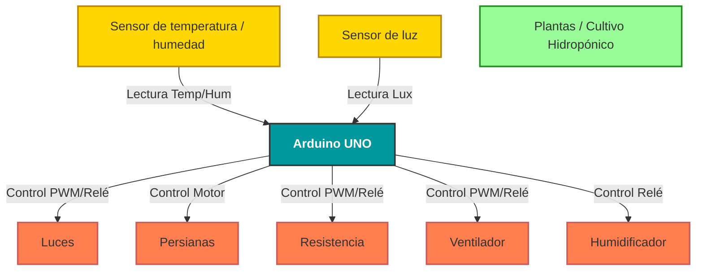

# Control neuronal de un invernadero

## Planteamiento del problema

Se desea automatizar un cultivo hidropónico de vegetales, considerando que para cada tipo vegetal existen diferentes requerimientos de temperatura, humedad e intensidad luminosa, y que además, dependen de la hora del día, es necesario que el controlador basado en algoritmo "Fuzzy Control", tenga cuatro entradas correspondientes a cada una de las siguientes variables:

| Variable | Tipo | Descripción |
| :---: | :---: | :---: |
| Temperatura | Numérico (°C) | Rango: 0-40 |
| Hora | Categórica (mañana, día, noche) | Codificada como one-hot o número (0-2) |
| Luminosidad | Númerico (lúmenes) | Rango: 0-1000 |
| Humedad | Numérico (%) | Rango: 0-100 |

Las salidas esperadas son:

| Variable | Tipo | Descripción |
| :---: | :---: | :---: |
| Resistencia | Categórica (apagada, media, máxima) | One-hot (0-2) |
| Ventilador | Categórica (apagada, media, máxima) | One-hot (0-2) |
| Persianas | Categórica (cerradas, medio abiertas, abiertas) | One-hot (0-2) |
| Luces | Categórica (apagadas, encendidas) | One-hot (0-1) |
| Humificador | Categórica (apagado, encendido) | One-hot (0-1) |

### Reglas para el funcionamiento del control del cultivo

1.1. Si la temperatura es menor a 5 grados centígrados, sin importar si es de mañana, día o noche, la Resistencia se Activa a máxima potencia y el ventilador se apaga.

1.2. Si la Temperatura esta entre (5 - 15) grados centígrados, si es de mañana se apaga la resistencia, si es de día se activa la resistencia a media potencia y si es de noche la Resistencia se apaga. El ventilador permanece apagado en cualquier horario.

1.3. Si la Temperatura esta entre (15 - 21) grados centígrados, si es de mañana se apaga la resistencia, si es de día se activa la resistencia a media potencia y si es de noche la Resistencia se apaga. El ventilador permanece encendido a media potencia en cualquier horario.

1.4. Si la Temperatura esta entre (22 - 32) grados centígrados, si es de mañana, día o noche, la Resistencia se apaga. El ventilador permanece encendido a maxima potencia en cualquier horario.

1.5. Si la Temperatura es mayor a 32 grados centígrados, si es de mañana, día o noche, la Resistencia se apaga. El ventilador permanece encendido a maxima potencia en cualquier horario.

2.1. Si la luminosidad es menor a 200 lúmenes. si es de mañana las persianas se cierran y las luces se apagan, de día las persianas se abren y la luz se enciende, si es de noche las persianas se cierran y las luces se apagan.

2.2. Si la luminosidad esta entre 300 y 200 lúmenes. si es de mañana las persianas se cierran y las luces se apagan, de día las persianas se abren y la luz se enciende, si es de noche las persianas se cierran y las luces se apagan.

2.3. Si la luminosidad esta entre 201 y 700 lúmenes. si es de mañana las persianas se cierran y las luces se apagan, de día las persianas se abren a la mitad y la luz se apaga, si es de noche las persianas se cierran y las luces se apagan.

2.4. Si la luminosidad es mayor a 700 lúmenes. si es de mañana las persianas se cierran y las luces se apagan, de día las persianas se cierran y la luz se apaga, si es de noche las persianas se cierran y las luces se apagan.

3.1. Si el porcentaje de humedad es menor a 40% el ventilador se apaga y el humidificador se enciende.

3.2. Si el porcentaje de humedad es mayor a 40% y menor a 70%, el ventilador se apaga y el humidificador se apaga.

3.3. Si el porcentaje de humedad es mayor a 70%, el ventilador se enciende y el humidificador se apaga.

### Esquema simplificado del problema

## Datos para la Red Neuronal

Para enetrenar una red neuronal que aprenda estos patrones se requieren datos como los de la siguiente tabla.

| Temperatura | Hora | Luminosidad | Humedad | Resistencia | Ventilador | Persianas | Luces | Humidificador |
|:---:|:---:|:---:|:---:|:---:|:---:|:---:|:---:|:---:|
| 4 | 0 | 150 | 30 | 2 | 0 | 0 | 0 | 1 |
| 10 | 1 | 250 | 50 | 1 | 0 | 2 | 1 | 0 |
| 18 | 2 | 500 | 75 | 0 | 1 | 0 | 0 | 0 |
| 25 | 0 | 800 | 65 | 0 | 2 | 0 | 0 | 0 |
| 35 | 1 | 100 | 45 | 0 | 2 | 2 | 1 | 0 |
| 20 | 1 | 650 | 85 | 1 | 1 | 1 | 0 | 0 |

Para la generación de estos datos se utilizó el código `generador_datos.py` el cual genera el archivo de datos `dataset_invernadero.csv` estos datos son utilizados para entrenar una red neuronal en el código `red_invernadero.ipynb`.

## Descripción de la red neuronal

### Arquitectura

El modelo se construyó con la API funcional de Keras. Tiene un tronco común de tres capas densas ocultas de 64, 64 y 32 neuronas, todas con función de activación ReLU.

Sobre ese tronco se colocan cinco capas de salida independientes, una por actuador:

* Resistencia, ventilador y persianas tienen tres niveles de operación (0, 1 y 2). Cada uno usa una capa de tres neuronas con activación softmax, que entrega la probabilidad de cada nivel. El nivel predicho es el de mayor probabilidad.
* Luces y humidificador solo pueden estar apagados o encendidos. Cada uno usa una neurona con activación sigmoide, y se considera encendido cuando la salida supera 0.5.

Con este diseño el problema se trata como cinco tareas de clasificación simultáneas y no como una regresión. Cada actuador recibe el tipo de salida que corresponde a su naturaleza. La red tiene aproximadamente 7 000 parámetros entrenables.

### Entrenamiento

Cada salida tiene su propia función de pérdida:

* Entropía cruzada categórica dispersa (sparse categorical crossentropy) para las salidas de tres clases.

* Entropía cruzada binaria para las salidas de dos clases.

La pérdida total es la suma de las cinco.

Se utilizó el optimizador Adam con una tasa de aprendizaje inicial de 0.003 y lotes de 32 muestras. Los datos se dividieron en 80 % para entrenamiento y 20 % para prueba, de forma estratificada según el nivel del ventilador. Del conjunto de entrenamiento se reservó además un 15 % para validación.

Para evitar el sobreajuste y no fijar arbitrariamente el número de épocas, se usaron dos mecanismos:

* Parada temprana (early stopping): detiene el entrenamiento cuando la pérdida de validación no mejora durante 60 épocas y restaura los mejores pesos encontrados.

* Reducción de la tasa de aprendizaje: la divide a la mitad cuando la pérdida se estanca durante 20 épocas.